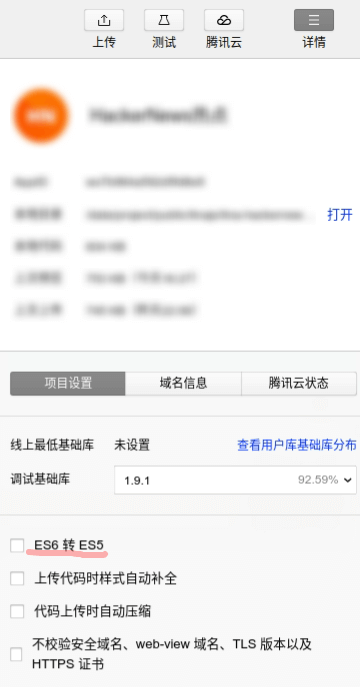

# tina-router
> An elegant enhanced router for Tina.js based Wechat-Mini-Program

[](https://www.npmjs.com/package/@tinajs/tina-router)
[](./LICENSE)
[](http://makeapullrequest.com)

## 快速上手
我们假设你已经在使用 [Tina](https://github.com/tinajs/tina) 和 [mina-webpack](https://github.com/tinajs/mina-webpack) 开发小程序项目。

### 安装
```bash
npm i --save @tinajs/tina-router
```

```javascript
/**
 * <script> in /app.mina
 */
import Tina from '@tinajs/tina'
import router from '@tinajs/tina-router'

Tina.use(router)

App(......)
```

### 使用
```javascript
/**
 * <script> in /pages/demo.mina
 */
import { Page } from '@tinajs/tina'
import { api } from '../api'

Page.define({
  onLoad () {
    api.fetchUser({ id: this.$route.query.id }).then((data) => this.setData(data))
  },
  methods: {
    toLogin () {
      this.$router.navigate(`/pages/login?from=${this.$route.fullPath}`)
    },
  }
})
```

## 常见问题
### 无法正确地自动获取底部 tab 列表
若 tina-router 无法正确地自动获取底部 tab 列表，请尝试将微信开发者工具的 "ES6 转 ES5" 功能关闭：



若仍不生效，可以在注册插件时手动设置：
```javascript
/**
 * <script> in /app.mina
 */
import Tina from '@tinajs/tina'
import router from '@tinajs/tina-router'

Tina.use(router, {
  tabs: [
    'page/home',
    'page/mine',
  ],
})

App(......)
```

## API
### Plugin.install
- 参数:
  - ``{Object} Tina`` Tina
  - ``{Object} config`` 同 ``createRouterMixin`` 中的参数 ``config``
- 说明:

  以插件的形式安装入 Tina。

### createRouterMixin
- 参数:
  - ``{Object} config``
    - ``{Array <String>} tabs`` MINA [tabbar](https://mp.weixin.qq.com/debug/wxadoc/dev/framework/config.html#tabbar) 中的所有页面路径。

      插件默认将自动从全局配置中读取该信息。

- 说明:

  创建混合对象。

### 对页面 / 组件的注入
#### $route
- 说明:

  路由信息对象。
  **仅页面可用，混入组件不生效。**

##### path
- 类型: ``String``
- 说明:

  当前页面的路径。

  ```javascript
  // /pages/demo?foo=bar
  Page({
    onLoad () {
      console.log(this.$route.path)
      // '/page/demo'
    },
  })
  ```

##### query
- 类型: ``String``
- 说明:

  当前页面的参数对象。

  ```javascript
  // /pages/demo?foo=bar
  Page({
    onLoad () {
      console.log(this.$route.query)
      // { foo: 'bar }
    },
  })
  ```

##### fullPath
- 类型: ``String``
- 说明:

  当前页面的完整路径。

  ```javascript
  // /pages/demo?foo=bar
  Page({
    onLoad () {
      console.log(this.$route.fullPath)
      // /pages/demo?full=bar
    },
  })
  ```

#### $router
- 说明:

  Router 实例。

### Router 实例
##### navigate(location)
- 参数:
  - ``{String} location`` 前往的路径
- 返回值: ``Promise``
- 说明:

  前往具体的路径。

  当目标路径属于导航栏标签 *(tabs)* 时，实际触发 ``reLaunch``
  *(需在创建混合对象时传入导航栏页面数组)* 。

  ```javascript
  Page({
    onLoad () {
      this.$router.navigate('/page/home')
    }
  })
  ```

##### redirect(location)
- 参数:
  - ``{String} location`` 重定向的路径
- 返回值: ``Promise``
- 说明:

  重定向具体的路径。

  当目标路径属于导航栏标签 *(tabs)* 时，实际触发 ``reLaunch``
  *(需在创建混合对象时传入导航栏页面数组。)* 。

  ```javascript
  Page({
    onLoad () {
      this.$router.redirect('/page/login')
    }
  })
  ```
##### back()
- 参数:
  - 无
- 返回值: ``Promise``
- 说明:

  后退。

  ```javascript
  Page({
    onLoad () {
      this.$router.back()
    }
  })
  ```
##### isTab(location)
- 参数:
  - ``{String} location`` 路径
- 返回值: ``Boolean``
- 说明:

  返回某路径是否属于导航栏项。
  *需在创建混合对象时传入导航栏页面数组。*

  ```javascript
  Page({
    onLoad () {
      if (this.$router.isTab('/page/home')) {
        console.log('homepage is one of the tabs')
      }
    }
  })
  ```

## License
Apache-2.0 @ [yelo](https://github.com/imyelo)
